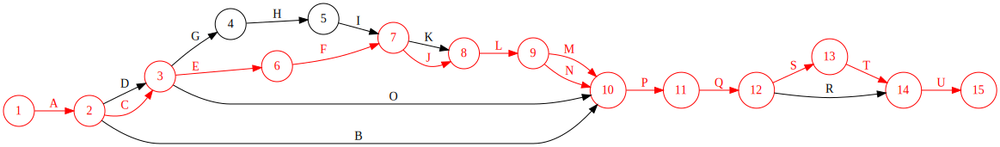

# Critical Path Method: Graph Visualization

This small program creates critical path visualization for a given Excel
workbook.

## Sample output

## Literature

- Hamdy A. Taha - Operations Research: An Introduction (2017, Pearson Education Limited)

## License and copyright

Copyright 2022-2023 Vitaly Potyarkin. Published under Apache-2.0 License
